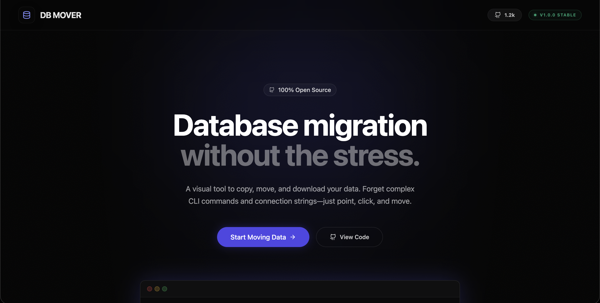

# DB MOVER

<div align="center">
  
</div>

<div align="center">

**The High-Performance Database Relocation Engine**

[](https://creativecommons.org/licenses/by-nc/4.0/)
[](https://github.com/JC-Coder/db-mover)

</div>

---

## 🚀 Overview

**DB Mover** is an open-source tool designed to simplify the complex process of database migration. It eliminates the need for complex CLI commands, connection strings wrestling, and manual dump file management.

With **DB Mover**, you can stream multi-cloud enterprise datasets with absolute precision, zero structural loss, and sub-second latency. It provides a visual interface to connect, select, and move your data effortlessly.

## ✨ Features

- **🚫 No CLI Required**: Stop wrestling with `mongodump` and `psql` flags. Connect your databases via a clean UI.
- **⚡ Direct Transfer**: Stream data directly from source to destination. No intermediate local storage required.
- **📦 Easy Backups**: One-click download of your entire database structure and data as a compressed archive.
- **🔒 Secure**: Your credentials and data never touch our persistent storage (ephemeral processing).
- **👁️ Live Monitoring**: Real-time progress tracking and logs for every collection and document transferred.

## 🗄️ Supported Databases

We currently support seamless migration for the following ecosystems:

- **MongoDB**
- **PostgreSQL**
- **MySQL**
- **Redis**
- _(More coming soon)_

## 🛠️ Tech Stack

- **Frontend**: React, Vite, Tailwind CSS, Framer Motion
- **Backend**: Node.js, Express, TypeScript
- **Architecture**: Streaming-based data pipeline

## 🚀 Getting Started

### Prerequisites

- Node.js (v18 or higher)
- npm or yarn

### Installation

1.  **Clone the repository**

    ```bash
    git clone https://github.com/JC-Coder/db-mover.git
    cd db-mover
    ```

2.  **Install dependencies**

    ```bash
    npm run install:all
    ```

3.  **Start the development server**

    ```bash
    npm run dev
    ```

    This will start both the client (port 5173) and the server (port 3000) concurrently.

4.  **Access the app**

    Open your browser and navigate to `http://localhost:5173`.

## 🤝 Contributing

We welcome contributions! Please see our [CONTRIBUTING.md](CONTRIBUTING.md) for details on how to get started.

## 📄 License

This project is licensed under the **Creative Commons Attribution-NonCommercial 4.0 International (CC BY-NC 4.0)**.

You are free to:

- **Share** — copy and redistribute the material in any medium or format.
- **Adapt** — remix, transform, and build upon the material.

Under the following terms:

- **Attribution** — You must give appropriate credit.
- **NonCommercial** — You may not use the material for commercial purposes (e.g., selling it as a SaaS product).

See the [LICENSE](LICENSE) file for the full text.
